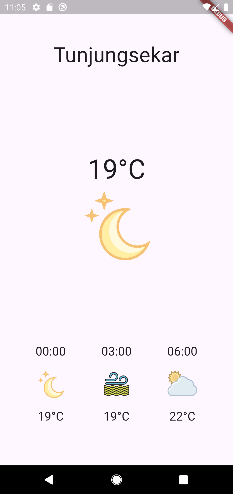

# 🌦️ Flutter Weather App

Aplikasi prakiraan cuaca sederhana yang dibuat menggunakan **Flutter** dan **Dart**. Aplikasi mengambil data prakiraan cuaca secara langsung dari **API BMKG**, kemudian mengolah dan menampilkannya pada antarmuka aplikasi.

Project ini dibuat sebagai contoh pembelajaran untuk memahami bagaimana aplikasi Flutter dapat mengambil data dari API, mengolah JSON menjadi object Dart, dan menampilkan data tersebut secara dinamis pada GUI.

## 📱 Tampilan Aplikasi

<p align="center">
  
</p>

Aplikasi menampilkan:

* 📍 Nama lokasi
* 🌡️ Suhu saat ini
* 🌤️ Ikon kondisi cuaca
* 🕐 Tiga waktu prakiraan berikutnya
* 🌡️ Suhu untuk setiap waktu prakiraan
* 🌐 Data yang diperoleh langsung dari API BMKG

---

## 🚀 Teknologi yang Digunakan

| Teknologi       | Kegunaan                                |
| --------------- | --------------------------------------- |
| **Flutter**     | Framework untuk membangun aplikasi      |
| **Dart**        | Bahasa pemrograman                      |
| **BMKG API**    | Menyediakan data prakiraan cuaca        |
| `http`          | Mengirim HTTP request ke API            |
| `flutter_svg`   | Menampilkan ikon cuaca dalam format SVG |
| `FutureBuilder` | Menampilkan data asynchronous pada GUI  |

---

## 🔄 Alur Kerja Aplikasi

Data cuaca diperoleh melalui beberapa tahap:

```text
┌─────────────────┐
│  Flutter App    │
└────────┬────────┘
         │
         │ HTTP GET
         ▼
┌─────────────────┐
│    API BMKG     │
└────────┬────────┘
         │
         │ JSON Response
         ▼
┌─────────────────┐
│   jsonDecode()  │
└────────┬────────┘
         │
         ▼
┌─────────────────┐
│   Dart Model    │
│ Weather/Forecast│
└────────┬────────┘
         │
         ▼
┌─────────────────┐
│  FutureBuilder  │
└────────┬────────┘
         │
         ▼
┌─────────────────┐
│       GUI       │
└─────────────────┘
```

Data dari API BMKG diubah dari JSON menjadi object Dart sebelum digunakan oleh bagian antarmuka aplikasi.

---

## 📂 Struktur Project

Struktur utama project dibuat berdasarkan fungsi masing-masing file:

```text
weather_app/
│
├── android/
├── ios/
├── lib/
│   ├── main.dart
│   │
│   ├── models/
│   │   └── weather.dart
│   │
│   ├── services/
│   │   └── weather_service.dart
│   │
│   └── screens/
│       └── weather_page.dart
│
├── screenshots/
│   └── weather_app.png
│
├── pubspec.yaml
└── README.md
```

### `main.dart`

Menjadi titik awal aplikasi dan menjalankan `WeatherPage`.

### `models/weather.dart`

Berisi model Dart untuk merepresentasikan data cuaca:

* `Weather` untuk menyimpan informasi lokasi dan kumpulan prakiraan.
* `Forecast` untuk menyimpan satu data prakiraan.

### `services/weather_service.dart`

Menangani komunikasi dengan API BMKG, mulai dari mengirim HTTP request sampai mengubah response JSON menjadi object `Weather`.

### `screens/weather_page.dart`

Mengatur tampilan aplikasi dan menggunakan data dari `WeatherService` untuk ditampilkan pada GUI.

---

## 🌐 API BMKG

Aplikasi menggunakan API prakiraan cuaca BMKG untuk memperoleh data cuaca.

Endpoint yang digunakan:

```text
https://api.bmkg.go.id/publik/prakiraan-cuaca?adm4=35.73.05.1008
```

Kode `adm4` digunakan untuk menentukan wilayah administratif yang menjadi lokasi prakiraan.

Data yang digunakan oleh aplikasi antara lain:

```text
lokasi.desa
data[0].cuaca[0][].local_datetime
data[0].cuaca[0][].t
data[0].cuaca[0][].weather_desc
data[0].cuaca[0][].image
```

Data tersebut digunakan untuk menampilkan nama lokasi, waktu prakiraan, suhu, deskripsi cuaca, dan ikon cuaca.

---

## 📦 Package

Project menggunakan dua package eksternal.

### `http`

Digunakan untuk mengirim request ke API BMKG.

```bash
flutter pub add http
```

### `flutter_svg`

Digunakan untuk menampilkan ikon cuaca dalam format SVG.

```bash
flutter pub add flutter_svg
```

---

## ⚙️ Persiapan Project

Pastikan **Flutter SDK** sudah terpasang pada komputer.

Clone repository:

```bash
git clone <URL_REPOSITORY>
```

Masuk ke folder project:

```bash
cd weather_app
```

Install dependency:

```bash
flutter pub get
```

Periksa perangkat yang tersedia:

```bash
flutter devices
```

Kemudian jalankan aplikasi:

```bash
flutter run
```

---

## 🤖 Android Internet Permission

Karena aplikasi mengambil data dari internet, Android perlu diberikan permission untuk mengakses jaringan.

Tambahkan permission berikut pada:

```text
android/app/src/main/AndroidManifest.xml
```

```xml
<uses-permission android:name="android.permission.INTERNET"/>
```

Permission ditempatkan di dalam tag `<manifest>` dan di luar tag `<application>`.

---

## 🎯 Konsep yang Dipelajari

Project ini dapat digunakan untuk mempelajari beberapa konsep dasar pengembangan aplikasi Flutter:

* Widget dasar Flutter
* `Column` dan `Row`
* Custom widget
* HTTP request
* REST API
* JSON
* `jsonDecode()`
* Dart *class model*
* `Future`
* `async` dan `await`
* `FutureBuilder`
* Pengolahan `DateTime`
* Penanganan loading dan error
* Pengambilan data secara dinamis dari server

---

## 🧩 Fitur Utama

### 📍 Informasi Lokasi

Nama lokasi diperoleh langsung dari data API BMKG.

### 🌡️ Suhu dan Kondisi Cuaca

Aplikasi menampilkan suhu dan ikon kondisi cuaca berdasarkan data yang diterima dari server.

### 🕐 Prakiraan Berdasarkan Waktu

Aplikasi mencari waktu prakiraan yang paling dekat dengan waktu saat aplikasi dijalankan.

### 📊 Tiga Prakiraan Berikutnya

Setelah menemukan waktu prakiraan awal, aplikasi mengambil tiga data prakiraan secara berurutan untuk ditampilkan pada bagian bawah layar.

### ⚠️ Penanganan Kondisi Data

Aplikasi menangani beberapa kondisi selama proses pengambilan data:

* Data sedang dimuat
* Request mengalami error
* Data tidak tersedia
* Data prakiraan tidak mencukupi

---

## 🛠️ Pengembangan Selanjutnya

Project ini dapat dikembangkan lebih lanjut, misalnya dengan:

* Menambahkan pilihan lokasi.
* Menampilkan prakiraan cuaca untuk beberapa hari.
* Menambahkan informasi kelembapan dan kecepatan angin.
* Menambahkan refresh data.
* Menambahkan desain responsif untuk berbagai ukuran layar.
* Memisahkan pengelolaan state dari tampilan.
* Menambahkan caching data.
* Menambahkan halaman detail prakiraan.

---

## 📚 Tujuan Pembelajaran

Project ini dirancang sebagai contoh sederhana untuk memahami alur pengembangan aplikasi Flutter yang mengambil data dari API.

Pembelajaran dimulai dari **GUI dengan data statis**, kemudian berkembang menjadi aplikasi yang mengambil data aktual dari server:

```text
GUI Statis
    ↓
HTTP Request
    ↓
JSON
    ↓
Dart Model
    ↓
Future & async/await
    ↓
FutureBuilder
    ↓
Data API → GUI Dinamis
```

Setiap bagian dapat dipelajari secara bertahap sehingga konsep Flutter, API, JSON, dan pengolahan data asynchronous dapat dipahami melalui satu project yang utuh.

---

## 👨‍💻 Project

**Flutter Weather App**

Dibangun menggunakan:

**Flutter + Dart + BMKG API**
